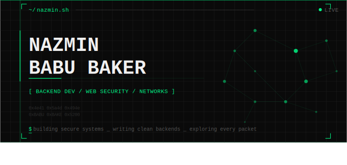
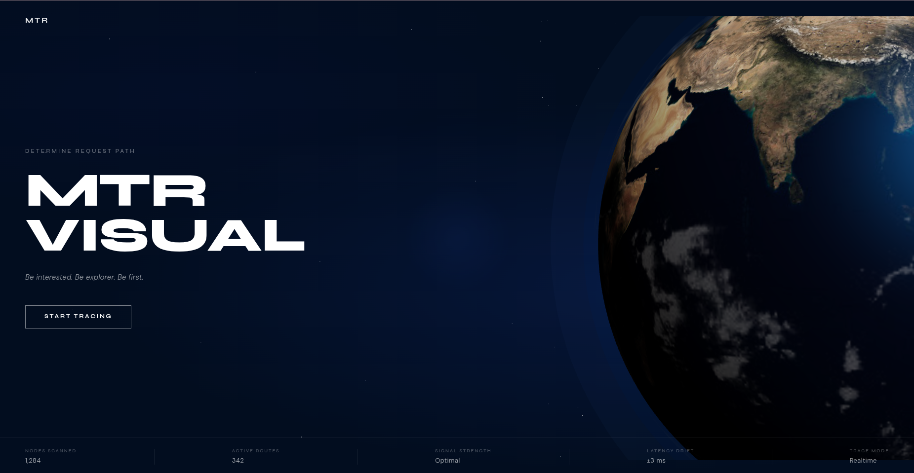
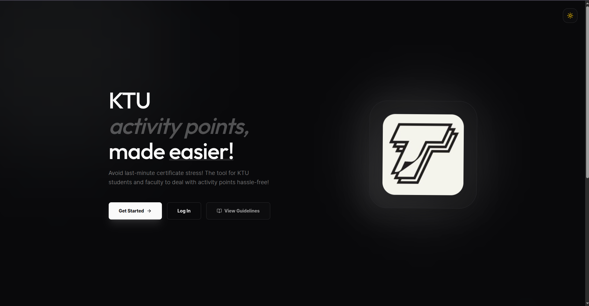
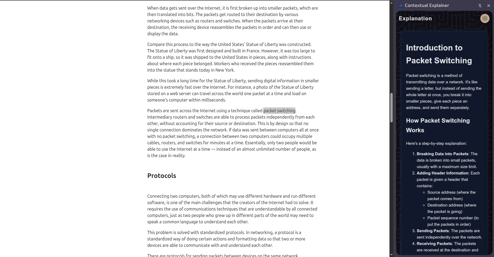
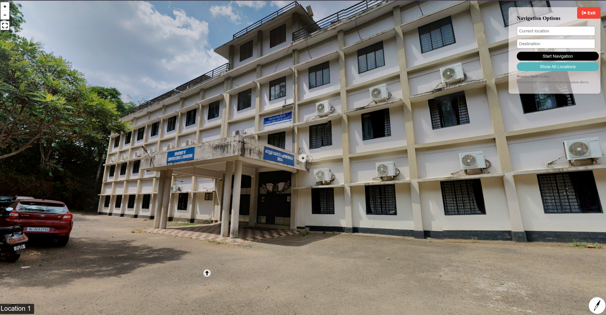
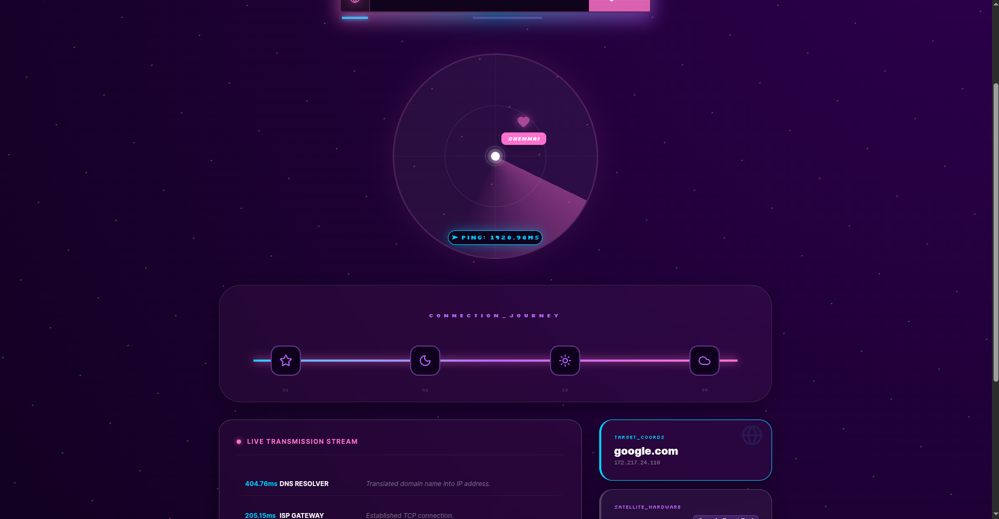

##  About Me

Computer Science student focusing on **Backend Development** and **Web Security**. I enjoy exploring network protocols, hunting for vulnerabilities, and building resilient web architectures. Always learning, always auditing. 💻🔒

##  Technical Toolkit

##  Featured Projects

<table align="center">
  <tr>
    <td align="center" width="33%">
       
      <a href="https://github.com/Nazmin-Babubaker/mtrvisual"><b>MTRVisual</b></a> 
      Network hop visualization and latency tracker.
    </td>
    <td align="center" width="33%">
       
      <a href="https://github.com/Nazmin-Babubaker/Tracktivity"><b>Tracktivity</b></a> 
      Activity point management system for KTU degree tracking.
    </td>
    <td align="center" width="33%">
       
      <a href="https://github.com/Nazmin-Babubaker/contextual-explainer"><b>Contextual-Explainer</b></a> 
      AI-driven tool for simplified technical concept explanations.
    </td>
  </tr>
  <tr>
    <td align="center" width="33%">
       
      <a href="https://github.com/Nazmin-Babubaker/RIT_TRACKER"><b>RIT-Tracker</b></a> 
       Indoor navigation and mapping for campus buildings.
    </td>
    <td align="center" width="33%">
       
      <a href="https://github.com/Nazmin-Babubaker/Adaptive-Cruise-Control"><b>ACC</b></a> 
      Simulation of an Adaptive Cruise Control system architecture.
    </td>
    <td align="center" width="33%">
       
      <a href="https://github.com/Nazmin-Babubaker/request-visualiser"><b>RequestScope</b></a> 
      Visualizing web requests and headers for security auditing.
    </td>
  </tr>
</table>

## 🏆 Achievements & Hackathons

* **Top Maker** | Tink-her-hack 4.0 
* **2nd Runner Up** | Tink-her-hack 3.0
* **Participant** | CodeRecet 
* **Participant** | TechThrive 
* **Creative Fun** | Useless Project 

## 📫 Connect with me

